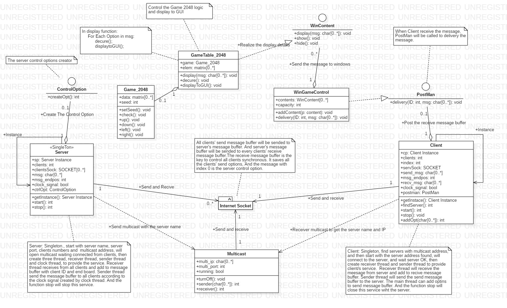

# Little_Multiplayer_Online
在线多人小游戏_2048版
支持局域网、广域网，单局游戏人数有限，本次示例为2048小游戏，由于程序窗口限制最大人数定为8人，可调整。

## 类图

## 程序逻辑

### 服务器
1.获取端口、连接数、多播IP和端口  
2.绑定端口，打开多播，等待连接  
3.接受客户端连接请求，验证、回发初始环境信息、记录  
4.全部连接成功后等待所有客户端准备成功消息  
5.所有客户端都准备成功，回发OK  
6.启动服务：接收线程、发送线程、时钟线程，通过缓冲区进行  
7.所有客户端都断开，关闭服务

### 客户端
1.获取多播IP和端口  
2.接收多播获取服务器列表  
3.指定服务器IP和端口进行连接  
4.发送验证消息，获取初始环境信息  
5.设置环境，通知准备就绪  
6.等待服务器启动消息  
7.启动服务：接收线程、发送线程，添加新消息线程(主线程)，发送和添加通过缓冲区进行，接收线程将接收的消息通过PostMan接口传输给程序  
8.客户端请求结束

## 分析

### 优点

1.每个客户端将自己的操作上传到服务端，服务端进行整合后再回发给所有客户端，每个客户端根据服务端的消息在沙盘上推演所有人包括自己的操作，就能在网速通畅下保证所有客户端的一致  
2.可以将消息直接在服务端推演执行，服务端推演执行完之后再将结果发送给所有客户端  

### 缺点和改进

1.当连接人数过多时，比如一百人，或者某些客户端的流量过大时，会导致服务端的转发频率增大，造成服务器效率的降低，也会使得每个客户端接收频率增大，降低客户端的效率；  
可以通过增大服务端的缓冲区大小，但缓冲区增大会影响接收线程接收消息；  
也可以减少连接数；  
还可以限制客户端单位时间内的流量；  
2.当游戏逻辑过于复杂时，每个消息的执行时间过长，也会影响接收和发送线程；  
3.受到网速的影响，程序会出现卡顿，但由于基于TCP传输所以还是能顺序执行， 如果基于UDP传输有可能出现丢包导致客户端顺序发A、B，结果执行的顺序确实B、A  
4.由于客户端每次都是直接发送消息的，所以不同客户端的消息先后不是他们的发送时间，而是在服务端被接收的时间，而客户端所看到游戏沙盘上的推演也不是自己消息的发送时间，而是接收服务端消息后推演完的时间，所以如果有客户端A的网络延迟了，所有客户端就会发现A操作延迟了，但其他正常的客户端自己的就不受影响；  
5.由于本次的2048小游戏的基本操作执行只要4个，而每个操作指令使用一个char（8位256）来传输有些过于浪费，所以可以在这一点上进行改进，通过2位或3位（保留1位）进行传输，可以大概提高3、4倍效率。  

## 算法来源

参考LockStep算法，通过加一个时间帧逻辑，服务端每次确定一个时间帧，发送给所有客户端，客户端发送时带上这一个时间帧，服务端接收时若是发现这一时间帧一致就证明这一消息是当前需要的，接收，不一致则证明这是之前的，丢弃，当服务端接收到所有客户端这一时间帧的回复后才开启下一时间帧，所以能确保客户端的执行的同步的，但是可能出现其他所有客户端等待其中一个网速慢的客户端A，而本次示例则是基于LockStep改进的乐观帧锁定算法，当A延迟时，其他人不执行等，正常运行，就会出现只有A出现延迟而已。可以应用导航推演——DR算法或影子跟随算法进行预先的动作推演，一般用于有连贯动作的游戏中，可以用来减少数据的传输，减轻服务器的负担，但是不适合像本次示例的2048游戏这种一次性操作、突发式游戏。
